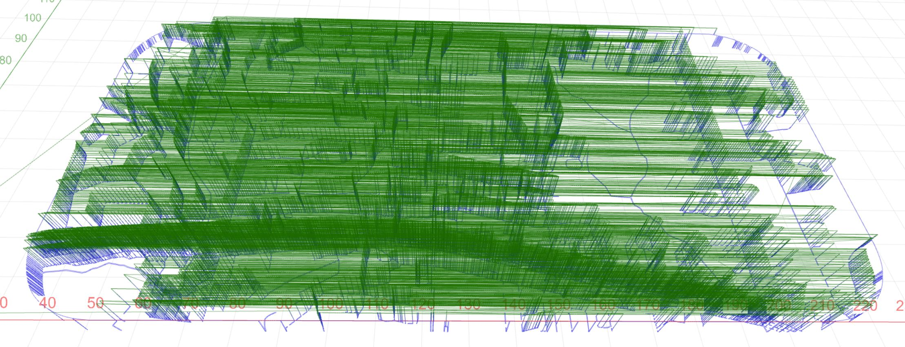
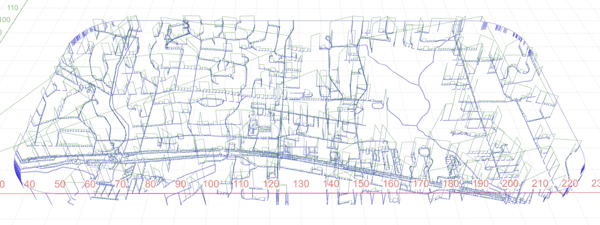

# VCarve-Texture-Path-Optimizer
It rearranges path traversal generated by VCarve's texture toolpath.

I have a map that I want to scribe using the texture toolpath feature of VCarve
This map has over 6886 individual paths to carve (dotted lines, etc).
The existing algorithm finds the next path to visit by sorting paths by their starting Y-height.

This unoptimized travel plan looks like this:

So this program accepts calling via the following format:

`node index.js <input_file_path> <output_file_path>`

And it transformed that into this:

For path segments less than or equal to 0.1in or 2.54mm the path will only make small Z-hops, 2.54mm above the bed.
This may not be good for you - this program is free to modify.
